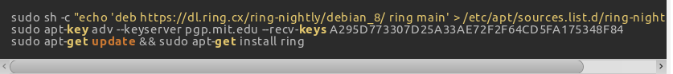
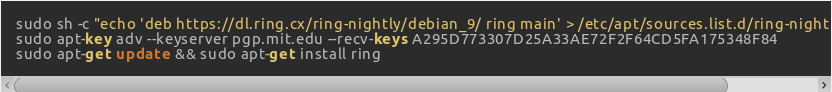
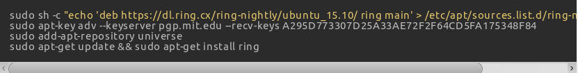
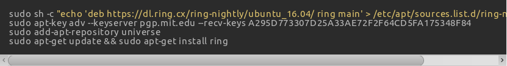

HOW TO INSTALL ON GNOME
=======================
                     
Depending on your system version, choose one of the following methods:

1. Automatic installation          |console|
-----------------------------------------------
.. |console| image:: install_GNOME/console.png
              :scale: 10 %
Run these commands in your terminal (choose the ones under your distribution):

.. toctree::
   :caption: Debian 8
   :maxdepth: 1
   :glob:

.. toctree::
   :caption: Debian 9
   :maxdepth: 1
   :glob:

.. toctree::
   :caption: Ubuntu 15.10
   :maxdepth: 1
   :glob:

.. toctree::
   :caption: Ubuntu 16.04
   :maxdepth: 1
   :glob:

.. toctree::
   :caption: Fedora 23
   :maxdepth: 1
   :glob:

.. toctree::
   :caption: Fedora 24
   :maxdepth: 1
   :glob:

.. toctree::
   :caption: Fedora 25
   :maxdepth: 1
   :glob:

2. Manual installation			|package|
--------------------------------------------------
a.    Download the Daemon package.
b.    Then, download the GNOME package.

+------------+------------+------------+--------------+--------------+
| Package    |  Debian 8  | Debian 9   |Ubuntu 15.10  | Ubuntu 16.04 |
+============+============+============+==============+==============+
|   Daemon   |    D_D8_   |    D_D9_   |  D_U15.10_   |  D_U16.04_   | 
+------------+------------+------------+--------------+--------------+
| GNOME      |    G_D8_   |    G_D9_   |  G_U15.10_   |  G_U16.04_   |
+------------+------------+------------+--------------+--------------+

.. _D_D8: https://dl.ring.cx/ring-manual/debian_8/ring-daemon_amd64.deb
.. _G_D8: https://dl.ring.cx/ring-manual/debian_8/ring_amd64.deb
.. _D_D9: https://dl.ring.cx/ring-manual/debian_9/ring-daemon_amd64.deb
.. _G_D9: https://dl.ring.cx/ring-manual/debian_9/ring_amd64.deb
.. _D_U15.10: https://dl.ring.cx/ring-manual/ubuntu_15.10/ring-daemon_amd64.deb
.. _G_U15.10: https://dl.ring.cx/ring-manual/ubuntu_15.10/ring_amd64.deb
.. _D_U16.04: https://dl.ring.cx/ring-manual/ubuntu_16.04/ring-daemon_amd64.deb
.. _G_U16.04: https://dl.ring.cx/ring-manual/ubuntu_16.04/ring_amd64.deb
