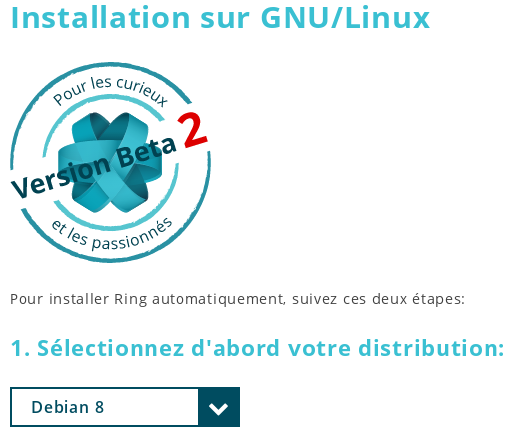

Documentation de l'installation de RING sur GNOME/Linux
========================================================
Pour installer RING sur GNOME/Linux, il faut d'abord visiter le site d'installation de RING:

| 1) Dans le navigateur web, il faut visiter l'adresse https://ring.cx/fr
|

| 2) Dans le menu en haut de page, cliquer sur "Télécharger".
|

| 3) Cliquer sur GNU/Linux.
|

|
| 4) Choisir votre mode d'installation:
|
|
Si vous désirez exécuter une installation manuelle, suivre les étapes suivantes:

| 4.1.1) Cliquer sur le lien dans la section "Installation Manuelle": "installer Ring en mode manuel".
|

| 4.1.2) Sélectionner votre distribution de GNOME/GNU/Linux.
|

| 4.1.3) Cliquer sur le bouton pour télécharger le paquet Daemon de Ring.
|

| 4.1.4) Installer le paquet Daemon.
|
| 4.1.5) Cliquer sur le bouton pour télécharger le paquet Client(UI).
|

| 4.1.6) Installer le paquet Client(UI).
|
|
Si vous désirez exécuter une installation par ligne de commande, suivre les étapes suivantes:

| 4.2.1) Sélectionner votre distribution de GNOME/GNU/Linux.
|

| 4.2.2) Ouvrir un terminal dans votre système d'exploitation.
|
| 4.2.3) Copier le texte qui se trouve dans la section noire.
|
.. image:: install_GNOME/Capture4-2-3.png
	:width: 400px	
	:height: 300px
	:align: center
| 4.2.4) Coller le texte dans le terminal et exécuter.

