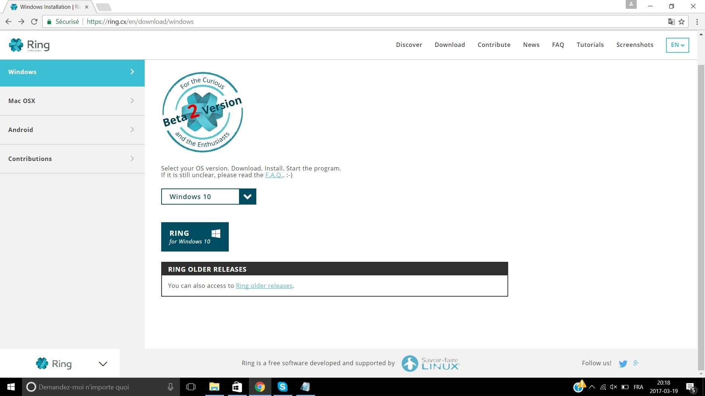
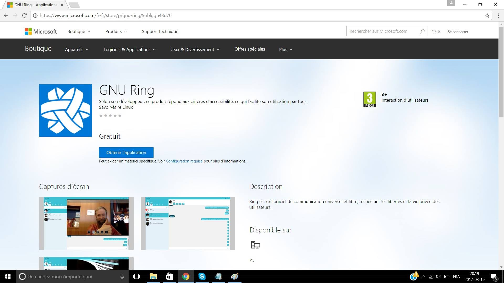
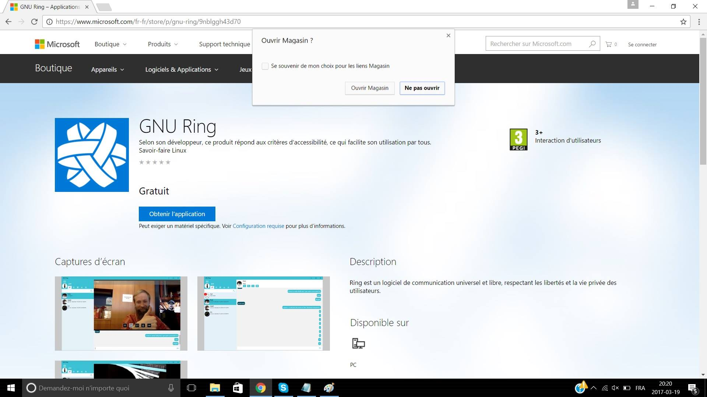
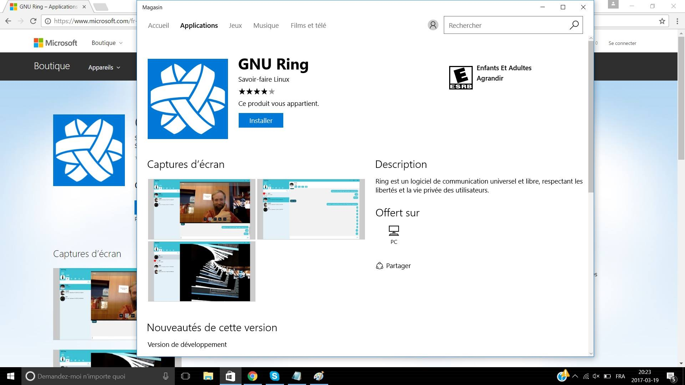
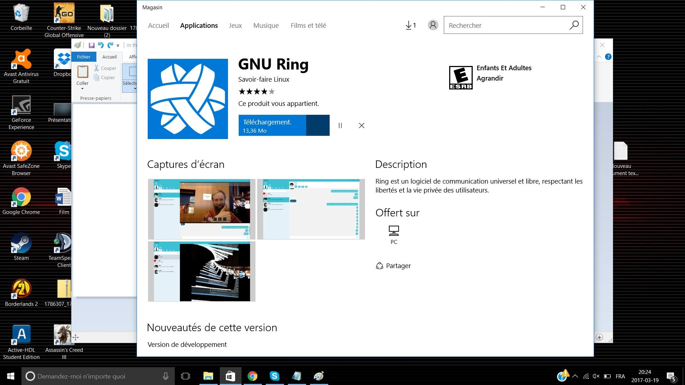
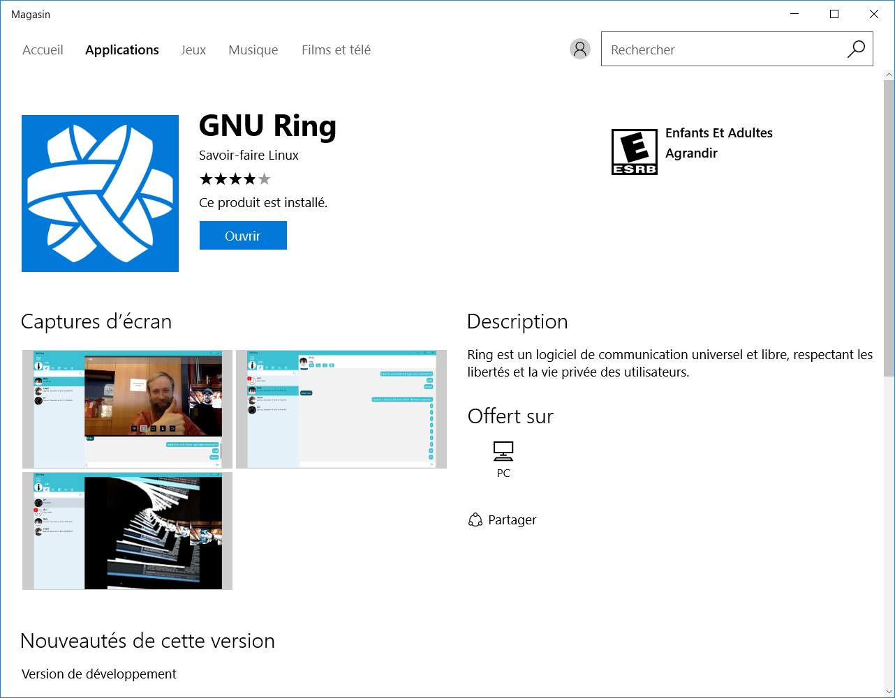
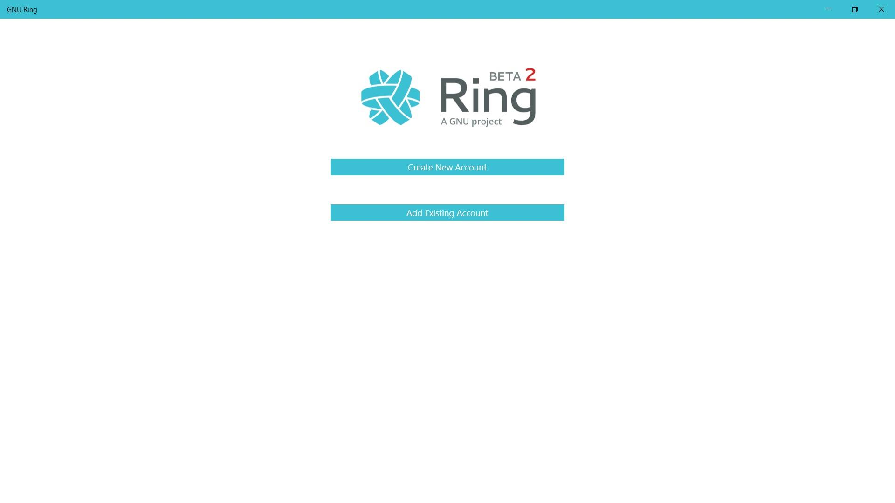

Install Ring on Windows10
========================================================
Follow the steps to install ring under windows 10.

First select windows 10 version and then clik on "Ring for Windows 10".
It will bring you to the microsoft store.

Now clik on "Obtenir l'application".
Then a  window is going to appear asking you if you want to open it in the store.
Click on "open the store".

Now the windows store will open on the downloadinf page of ring.

Click on download the app then the download and the installation will begin.

Ring is now installed on your pc.

Ring is now ready for use.

Thanks for installing

