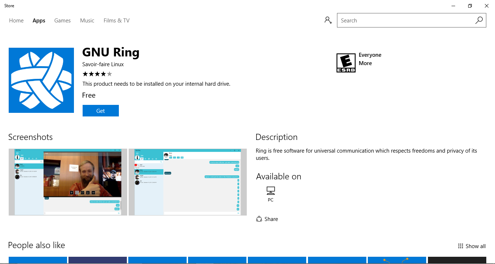
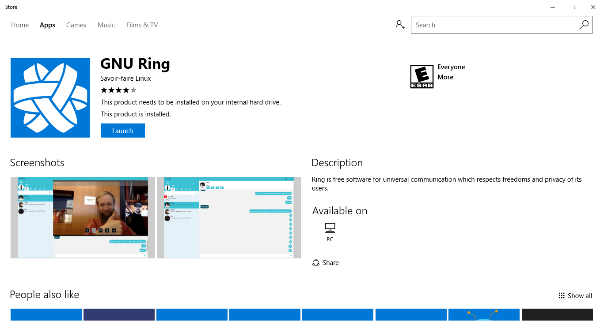

.. _install_windows10:

Install Ring on Windows10
========================================================
Follow these steps to install ring on your windows 10.

Go to Ring_ download page, and click on "Ring for Windows 10".
You will be redirected to the windows store.

.. _Ring: https://ring.cx/en/download/windows

Now click on "Get".

The application will be downloaded and installed on your computer.

After installing, click the Launch button and you are set to work with ring!!

