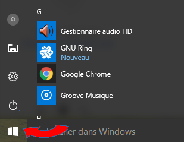
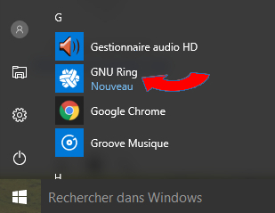
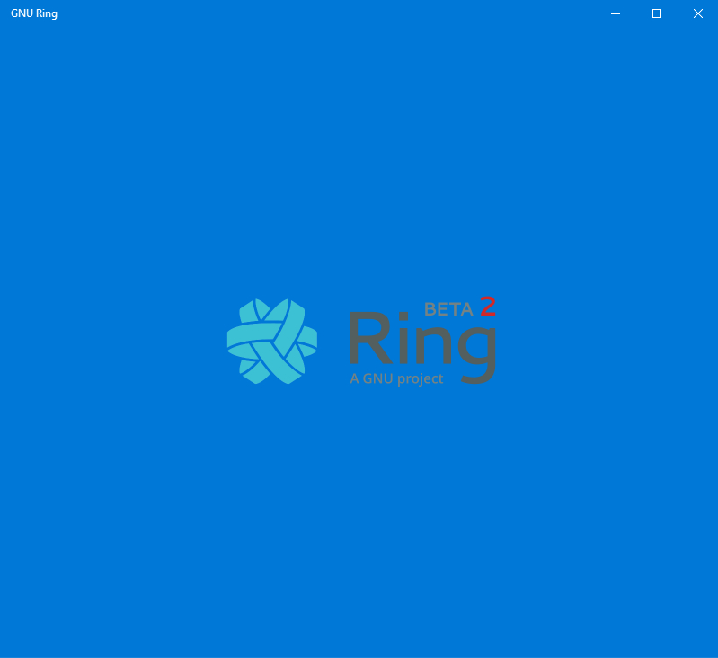
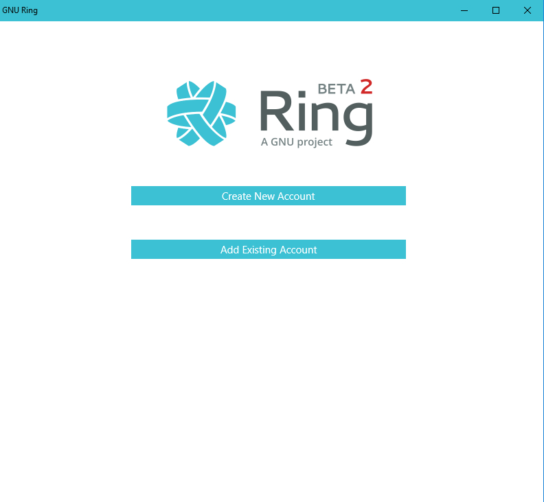

.. _building:
Ring Launch Documentation for Windows
========================================================

	To launch the application after downloading and installing it, we must first:
	
	1. Press or click the windows button or the start button on the taskbar (at the bottom left of the screen)

		|lancer_client_Windows|

	2. Scroll down to find the GNU RING application, and then click on it

		|lancer_client_Windows2|

	3. Then the following loading screen should appear
	
		|lancer_client_Windows3|
	
	4. Finally the authentication screen should appear, if you do not have an account please refer to the section "create an account"
	
		|lancer_client_Windows4|

.. toctree::

