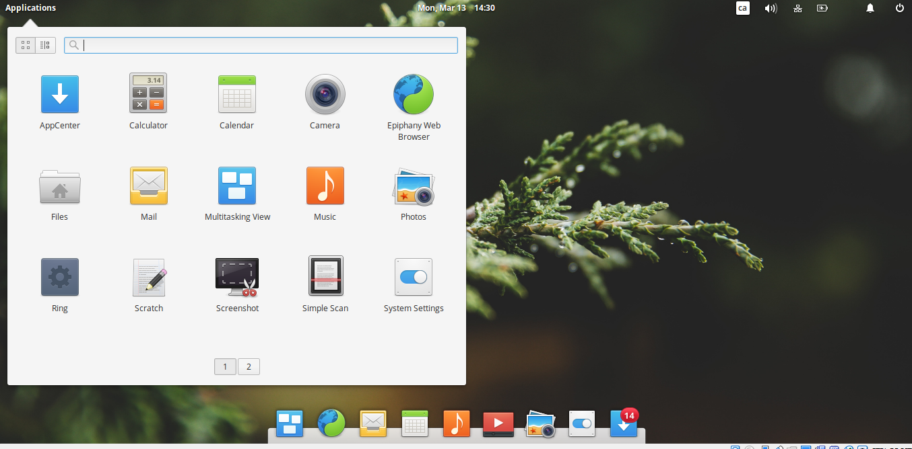
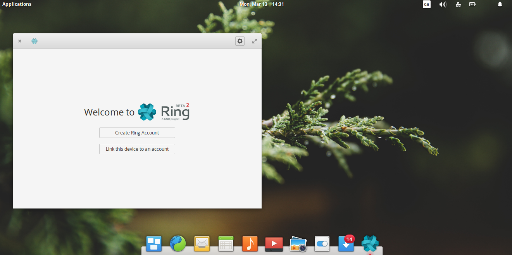

.. lancer_gnome:

Documentation pour lancer l'application avec Gnome 
===================================================

*1. Rendez-vous dans votre section d'applications ou de programmes selon votre version de Gnome*
----------------------------------------------------------------------------------------------------

*2. Selectionner l'application RING*
---------------------------------------

*3. Lors de votre première connexion, cet page vous sera présentée*
---------------------------------------------------------------------------------

Vous aurez ainsi l'option de relier votre compte RING avec votre appareil.
Si toutefois, vous ne possèdez pas de compte, référez-vous à la section Créer un compte RING

**Vous avez réussi le lancement de RING!**

