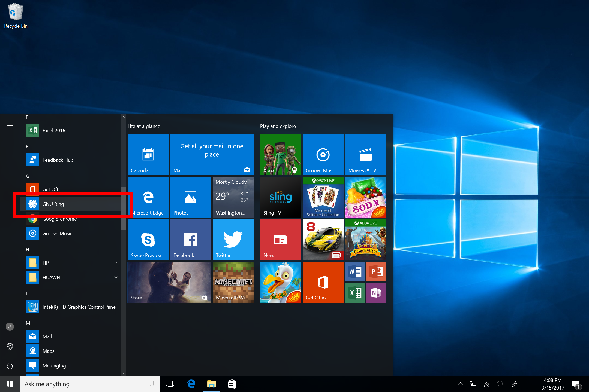

Launch the UWP GNU Ring app
=========================================================================

**This guide is only for the UWP version (installed from the Windows Store)**

In this guide, we will explain how to launch the UWP GNU Ring app. We consider that the app is installed on the computer. If it's not installed, follow the installation guide.

There are three main ways to launch the app: 

- From the `Windows Store`_
- From the `Start Menu`_
- From the `Search box`_

======
Start Menu
======

This is the most common and recommended way of launching the app. 

1. Open the Start Menu
--------------

To open the Start Menu click on the Windows Icon in the bottom left or click on the Windows key on your keyboard.

2. Find the app
-----------------

In the app list, find the app named "GNU Ring.” You might need to open the app list of older version of Windows or when you are in the tablet mode.

3. Launch the app
-----------------
Click on the app in the list to open it. The app should launch and show this screen.

Great! The app launched.

======
Windows Store
======

This method works best if you just downloaded the app from the store or if you are browsing the Windows Store.

1. Open the Windows Store
----------------

From the Start Menu or the taskbar open the Windows Store App.  

2. Search for the app
----------------

In the search box in the top right, search for "GNU Ring.” Select the first result in the list. 

3. Launch the app
----------------

To launch the app, click the "Launch" button. 

If the launch is successful, this screen should appear.

Great! The app launched.

======
Search Box
======

This method is an alternative to the Start Menu method. It's quicker and easier. 

1. Open the Search box
----------------

To open the Search box, click on the search box in the taskbar (in the bottom left beside the Start Icon). The Search box might be hidden. If it's the case, click on the search icon.  

The search dialog should open. If Cortona is activated, a similar screen should appear. 

2. Search for the app
----------------

Search for "GNU Ring". Select the app when it appears in the results.

3. Launch the app
----------------

Click on the "GNU Ring" in the list. 

If the launch is successful, this screen should appear.

Great! The app launched.

