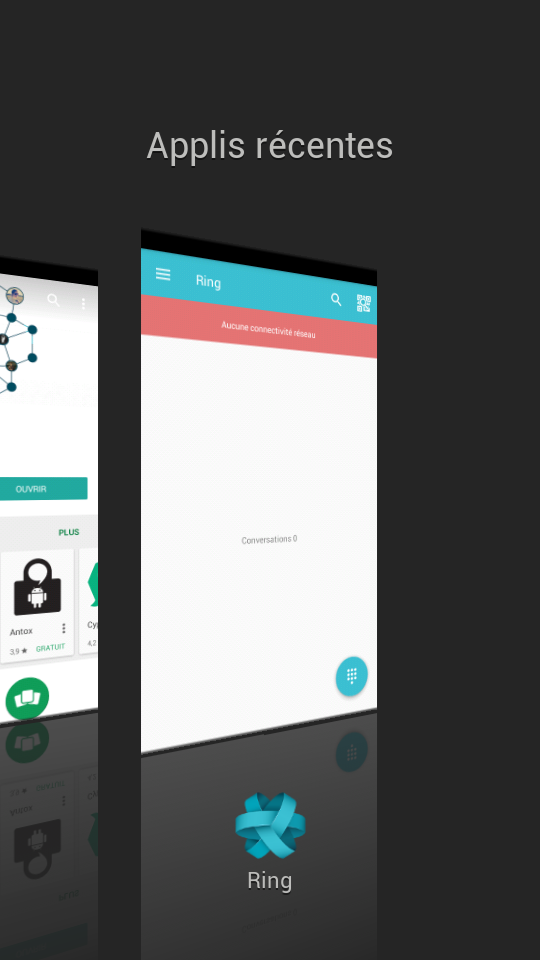
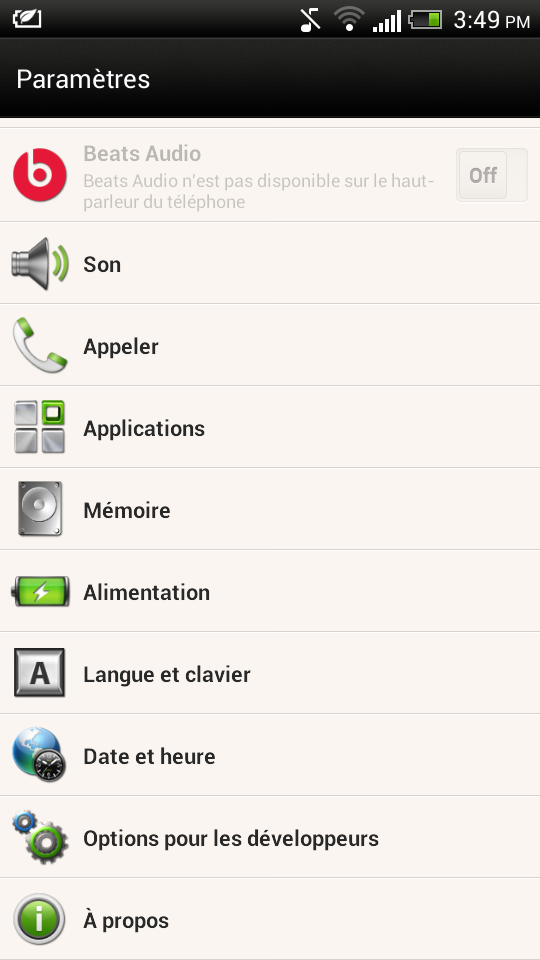
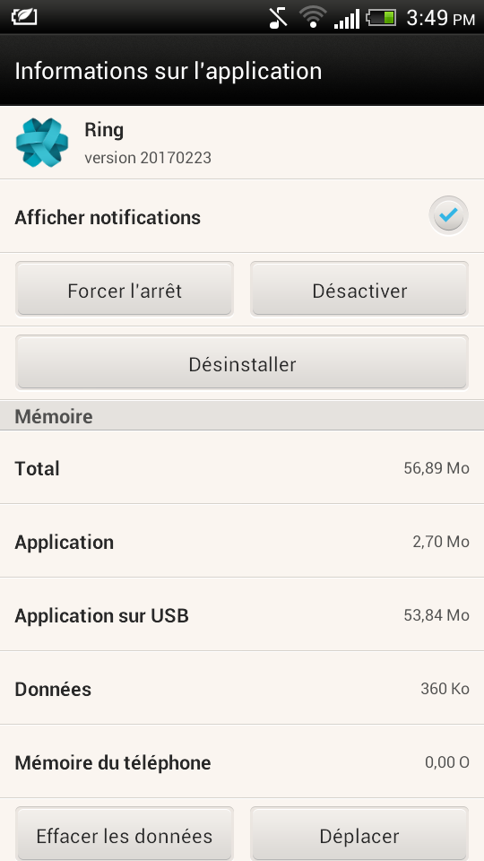

.. _quitter_Android:

Quitter sur Android
===================

Quitter l'application Ring permet d'arrêter toutes les fonctionnalités, et ainsi d'optimiser sa consommation d'énergie et de données internet.

L'application Ring ne contient pas une fonctionnalité en tant que tel sur le système d'exploitation Android. Cependant, il est nécessaire de fermer Ring pour éviter qu'elle reste active en arrière-plan inutilement. Or, Android permet de fermer facilement les applications actives à tout moment.

Par le multitâche
#################

* Ouvrez le multitâche en appuyant sur le bouton en bas à gauche de l'écran.

* Dans la liste des logiciels, trouvez l'application Ring.
* Glisser l'image de l'application hors de la liste. Généralement, il faut glisser l'application vers le haut.

Par les Réglages/Paramètres
###########################

Si un problème empêche la fermeture de l'application, vous pouvez forcer l'arrêt de Ring grâce aux réglages de votre téléphone.

* Ouvrez l'application "Paramètres" ou "Réglages" de votre téléphone.
* Sélectionnez la section "Applications" et trouvez Ring dans la liste des applications. Celle-ci se trouve dans l'onglet "En cour" des versions plus récentes d'Android. 

* Cliquez sur "Forcer l'arrêt".

