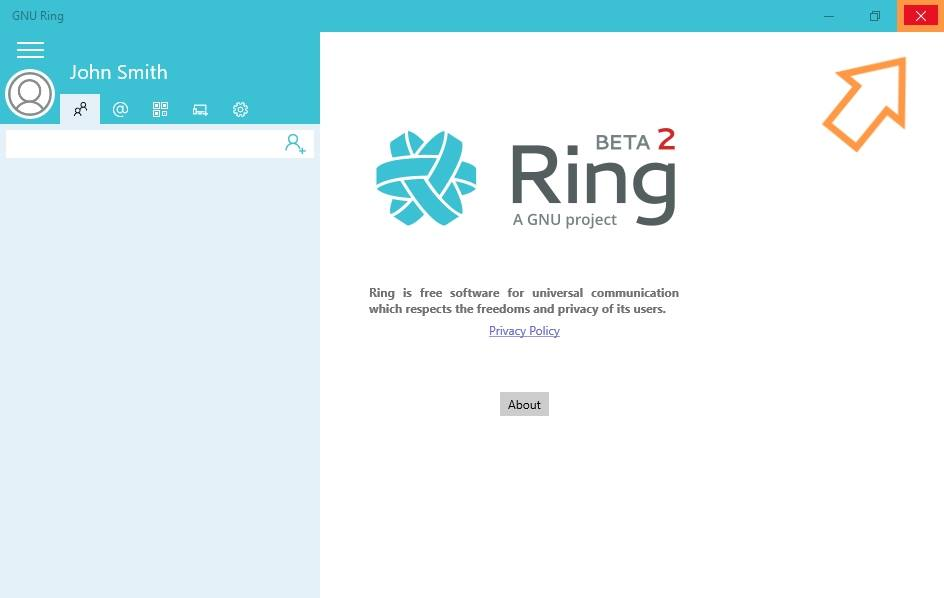

.. _building:

Documentation about the "Exit" Ring functionality 
=======================================================
The user can exit from anywhere in the app so in all these sections

- Settings
- Add a device
- Add a contact
- Get a QR code
- Get your Ring ID

In order to exit the application, click on the red "X" on the top right of the screen, as shown below |image|

:Authors:
    Jean-Sébastien Laperrière,

    Nicolas Raverdy

    

:Version: 1.0 of 2017/03/06
:Dedication: To my beloved Teacher Bram Adams. 

