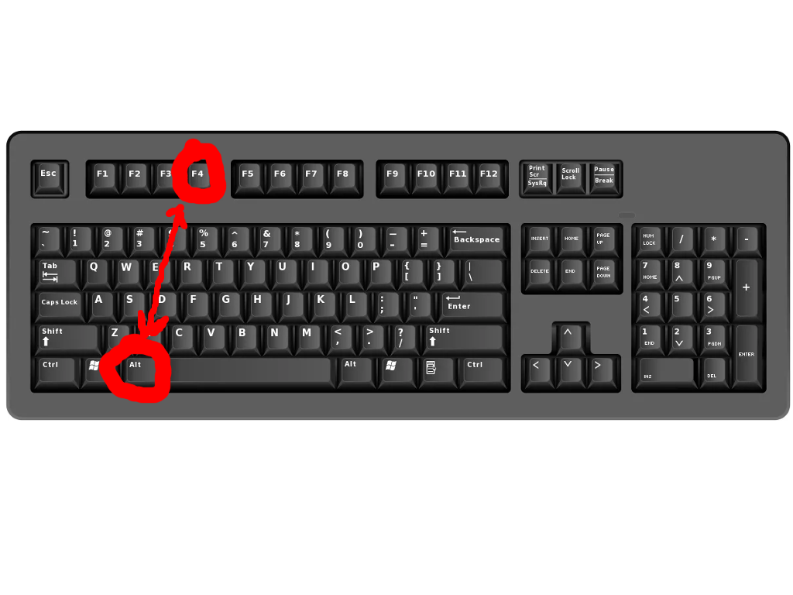

Documentation des etudiants de developpement logiciel open source 1684089 et 1784158
=======================================================================
Travail partqiue #3: Quitter Ring
=======================================================================
La finctionalite "Quitter" de RING permet a un utilisateur de fermer le programme a tout moment desire. Cela lui permettra donc de sortir a l'exterieur et d'avoir de vraies conversations avec de vrais etres humains.

Pour quitter, il y a deux facons fiables, nous allons les expliquer ci dessous:

1 - Reperez la barre superieure de la fenetre de RING afin de voir ces boutons suivants:

2- La deuxieme facon de quitter RING de facon instentanee est d'appuyer sur ALT+F4 sur le clavier, cette commande universelle fonctionne egalement avec RING et fermera le programme.

What the quit did you just quitting quit about me, you little quitter? I’ll have you know I graduated top of my class in the Navy Quits, and I’ve been involved in numerous secret raids on Al-Quita, and I have over 300 confirmed quits. I am trained in quitilla warfare and I’m the top quitter in the entire US armed forces. You are nothing to me but just another running task. I will quit you the quit out with precision the likes of which has never been seen before on this Earth, mark my quitting words. You think you can get away with saying that shit to me over the Internet? Think again, quitter. As we speak I am contacting my secret network of quits across the USA and your IP is being quitted right now so you better prepare for the quit, maggot. The quit that wipes out the pathetic little thing you call your process. You’re quitting ended, kid. I can be anywhere, anytime, and I can quit you in over seven hundred ways, and that’s just with my bare hands. Not only am I extensively trained in unarmed quit, but I have access to the entire arsenal of the United States Marine Quits and I will use it to its full extent to quit your miserable ass off the face of the continent, you little shit. If only you could have known what unholy retribution your little “clever” comment was about to bring down upon you, maybe you would have quit your quitting tongue. But you couldn’t, you didn’t, and now you’re paying the price, you goddamn idiot. I will quit fury all over you and you will drown in it. You’re quitting taskkilled, kiddo.
