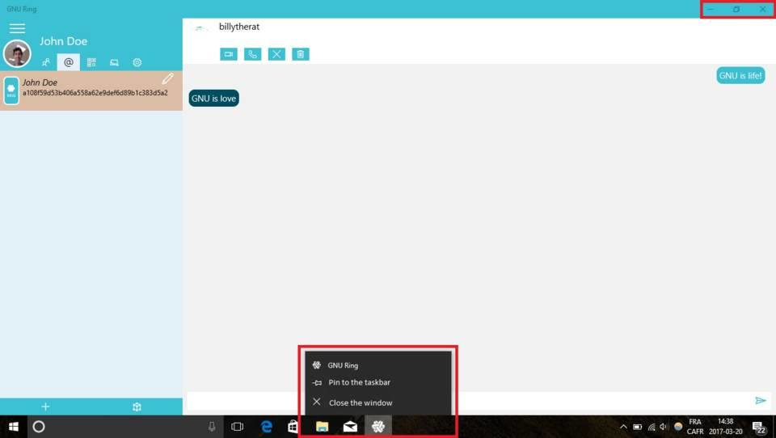

==========================================================
 Exit the GNU Ring app on UWP (universal Windows Platform)
==========================================================

Exit the app
############

- From the app, locate and click on the **X** button in the top right corner. You can also right click on the Ring logo in your taskbar (normally on the lower extremity of the screen) and click on **Close the window**.

