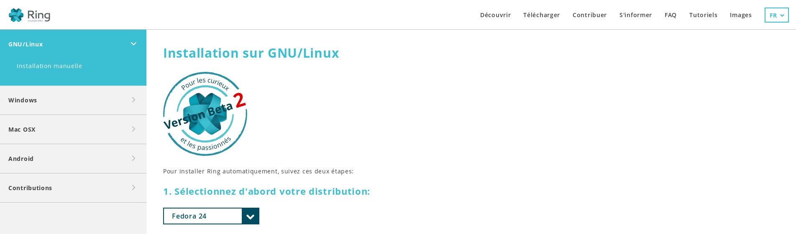
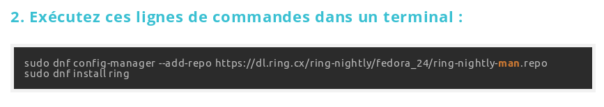
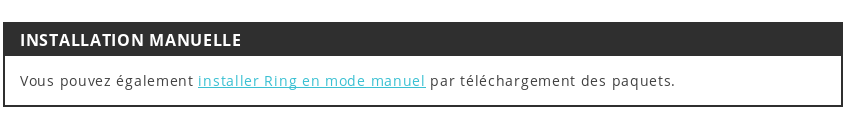
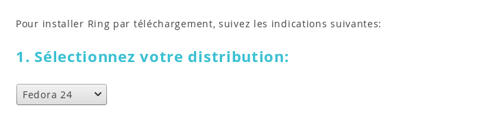

.. _building:
Téléchargement pour client GNOME
================================

Installation avec le terminal
-----------------------------

Pour télécharger Ring sur votre environnement GNOME, il faut commencer par se rendre sur la page d'installation pour `gnu-linux <https://ring.cx/fr/telecharger/gnu-linux>`_.

Une fois sur le site, la prochaine étape consiste à choisir votre distribution Linux. Dans le cas de l'exemple, il s'agit de Fedora 24.

La prochaine étape consiste à executer une série de lignes de commande dans votre terminal. Les commandes à entrer sont affichées selon votre distribution Linux. Dans notre cas, pour Fedora 24, les voici : 

Après avoir ajouté le repository pour ring et avoir lancé la commande install, ring va automatiquement se télécharger et s'installer sur votre machine. Vous pouvez commencer à l'utiliser!

Installation manuelle
---------------------

Si vous préférez installer manuellement Ring sur votre environnement GNOME, rendez vous dans la section 
`d'installation manuelle <https://ring.cx/fr/telecharger/gnu-linux/manuel>`_, disponible en dessous de la section juste après celle du terminal.

D'ici, on vous demande de sélectionner votre distribution Linux.

Après avoir choisi votre distribution, vous devez télécharger et installer le paquet Daemon pour votre distribution.

Enfin, il vous faut télécharger et installer le paquet Client (UI) pour GNOME.

Vous pouvez maintenant commencer à utiliser Ring!

