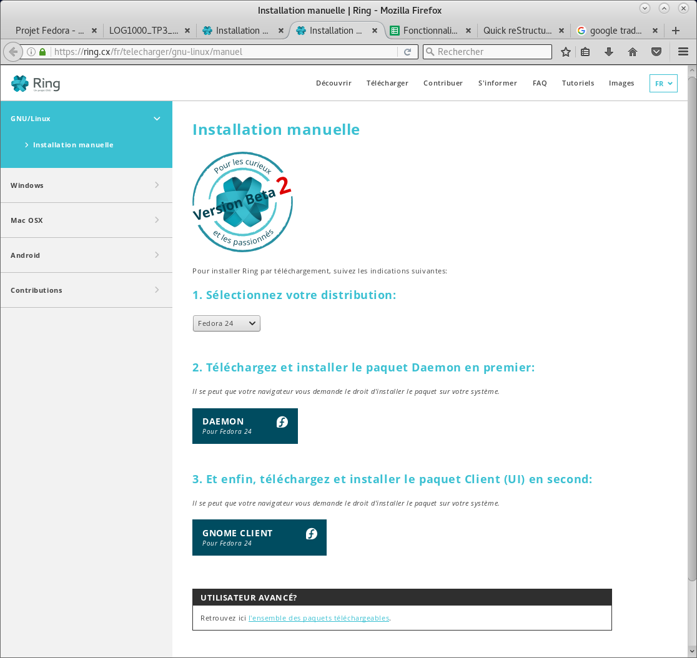

How to download Ring (Client Gnome)
===============================================

First way:

Go to: https://ring.cx/fr/telecharger/gnu-linux

You will be on this page 

Now you have to select in the drop down menu the version of your computer.
Here, it's Fedora 24. 
Then, open the terminal and write down:
sudo dnf config-manager --add-repo https://dl.ring.cx/ring-nightly/fedora_24/ring-nightly-man.repo

After that, copy in the terminal:
sudo dnf install ring

.. image:: telechargement_Gnome2.png

You have finished the download and start the installation.

Second way:

Go to: https://ring.cx/fr/telecharger/gnu-linux/manuel

Download and install Daemon for Fedora 24.
Then, download and install Gnome Client for Fedora 24.

You have officialy finish the download part.

