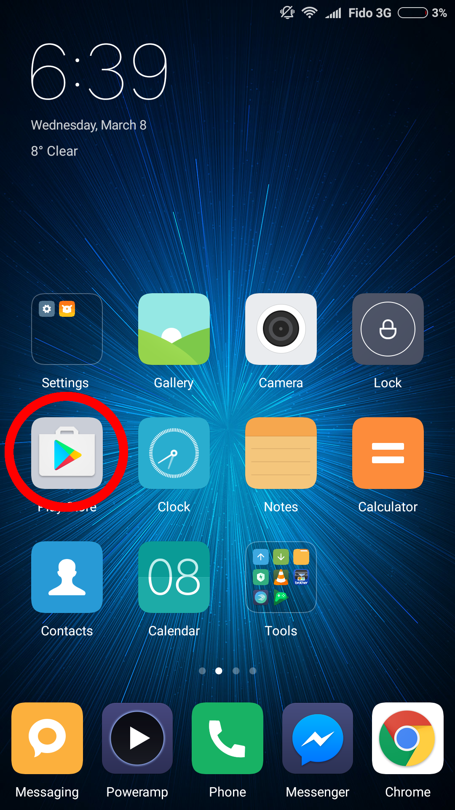
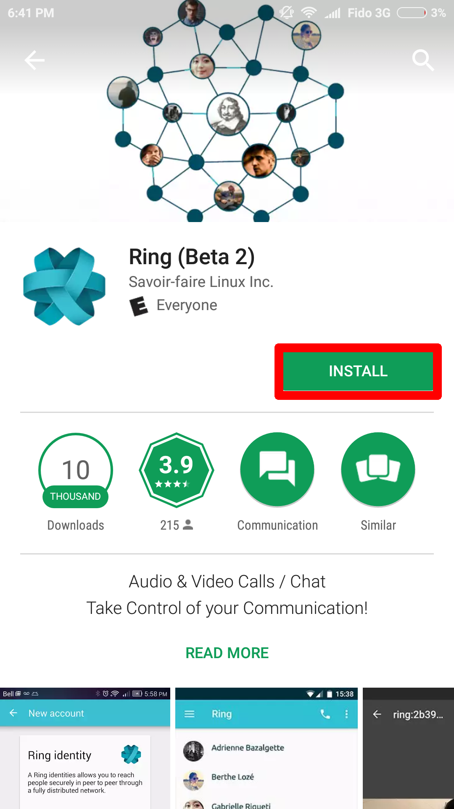
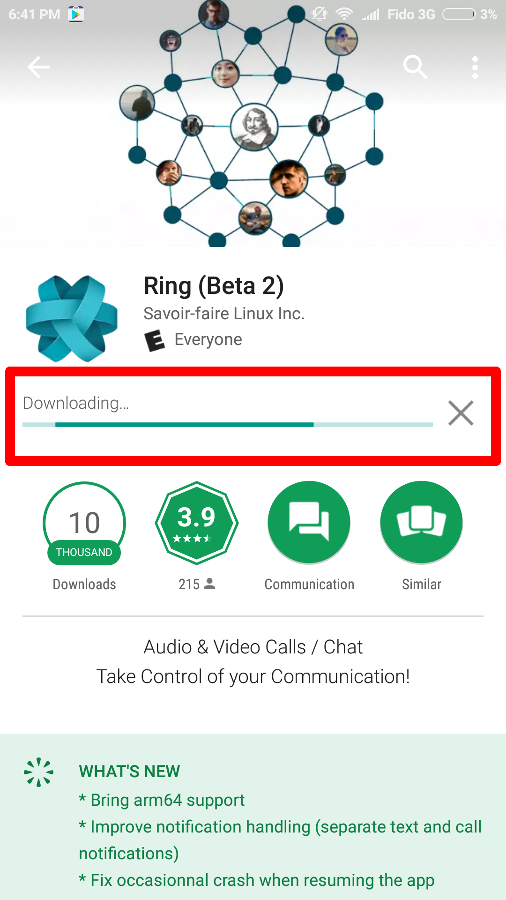
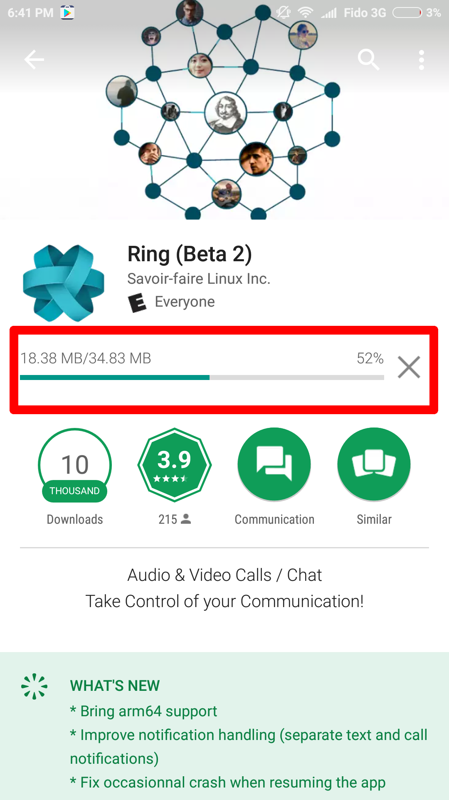

How to install Ring on an Android device
=====================================

Step 1: Locating
----------------
Locate the PlayStore on your device

Step 2: Seaching
----------------
Locate the seach bar in the PlayStore

Search for "ring savoir faire" and locate the correct application

Step 3: Downloading
-------------------
Click on the install button

Ring should start downloading immediatly.

